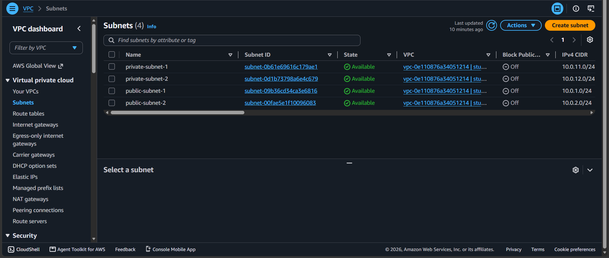

# AWS Multi-Tier VPC Architecture

## 📌 Project Overview

This project demonstrates the design and implementation of a secure AWS Multi-Tier VPC architecture using public and private subnets. The infrastructure includes EC2 instances, NAT Gateways, Internet Gateway, Route Tables, and AWS Systems Manager Session Manager for secure connectivity.

## 🏗️ Architecture

The architecture includes:

- Custom VPC
- 2 Public Subnets
- 2 Private Subnets
- Internet Gateway for public internet access
- 2 NAT Gateways for outbound internet access from private subnets
- Public and Private Route Tables
- Public EC2 Instance
- Private EC2 Instance
- AWS Systems Manager (SSM) Session Manager

## 🔄 Architecture Flow

```text
Internet
   │
Internet Gateway
   │
Public Subnets
   ├── Public EC2
   └── NAT Gateways
          │
     Private Subnets
          └── Private EC2
```

## 📸 Implementation Screenshots

### 1️⃣ VPC Configuration


### 2️⃣ Subnets



### 3️⃣ Route Tables


### 4️⃣ NAT Gateways


### 5️⃣ EC2 Instances


### 6️⃣ Private EC2 Internet Connectivity Test

The private EC2 instance successfully accessed the internet through the NAT Gateway.


### 7️⃣ Public EC2 Web Server Test

The public EC2 instance successfully hosted a web page accessible through its public IP address.


## 🧪 Testing Performed

- Verified the public EC2 instance connectivity
- Hosted and accessed a web server from the public EC2 instance
- Connected to the private EC2 securely using AWS Systems Manager Session Manager
- Verified outbound internet connectivity from the private EC2 instance through the NAT Gateway

## 💡 Key Learnings

- Designing custom VPC architectures
- Configuring public and private subnets
- Managing route tables and routing
- Using Internet and NAT Gateways
- Deploying EC2 instances in different network tiers
- Secure instance access using AWS Systems Manager

## 🛠️ Technologies Used

- Amazon VPC
- Amazon EC2
- AWS NAT Gateway
- AWS Internet Gateway
- AWS Systems Manager (SSM)

---

⭐ This project was built as a hands-on AWS networking and cloud infrastructure implementation.
